# NEW GAME PLAN — Server/Cron Mimarisi ve Kaynak Envanteri

**Tarih:** 2026-07-22 → 2026-07-23 (iki günlük oturum, sürekli güncellendi)
**Durum:** `aggregator` + `netcdf-service` + **10 zamanlanmış `raster-importer` konteyneri** canlıda, sürekli açık, sağlıklı. Supabase Edge Function deploy'u platform genelinde kırık (bkz. 4.7) — bu yüzden bugün eklenen/taşınan HER şey Docker konteynerlerinde çalışıyor, Edge Function'a bağımlı değil.

Bu doküman, iki günlük mimari inceleme oturumunda alınan tüm kararları ve tüm veri kaynaklarının GÜNCEL, GERÇEK durumunu tek bir yerde topluyor. `docs/Veri_Kaynaklari_Envanteri.docx` (genel kaynak envanteri) ile birlikte okunmalı.

---

## 0. Sistem Haritası (2026-07-23 itibarıyla, canlı doğrulanmış durum)

```mermaid
graph TB
    subgraph Frontend["Frontend (Vue, src/)"]
        MapView["MapView.vue<br/>(harita + katman paneli)"]
    end

    subgraph DB["Supabase Postgres + Realtime"]
        HazardTables["hazard tablolari<br/>(earthquake/wildfire/flood/<br/>drought/tsunami/epidemic/<br/>food_security)"]
        ExposureTables["exposure_datasets /<br/>exposure_features"]
        DataSources["data_sources<br/>(admin Kaynaklar sekmesi)"]
    end

    subgraph Agg["mhews-aggregator (Docker, restart:unless-stopped)"]
        EMSC["EMSC (WebSocket)"]
        USGS_AFAD_K_G["USGS / AFAD / Kandilli / GEOFON"]
        GDACS_srv["GDACS REST+RSS<br/>(multi_hazard)"]
        WHO_PTWC_FEWS["WHO / PTWC / FEWS NET"]
        FIRMS["NASA FIRMS"]
        Dynamic["dynamicSources.js<br/>(admin 'Kaynak Ekle', 60sn tarama)"]
    end

    subgraph RI["raster-importer/ ailesi (Docker, ayrı container'lar)"]
        GHSL_c["ghsl-importer<br/>(aylık)"]
        Meta_c["meta-ghsl-importer<br/>(SADECE elle — dataset donmuş)"]
        WorldPop_c["worldpop-importer<br/>(aylık)"]
        HydroBasins_c["hydrobasins-importer<br/>(aylık)"]
        HydroRivers_c["hydrorivers-importer<br/>(aylık)"]
        OsmB_c["osm-buildings-importer<br/>(haftalık)"]
        OsmR_c["osm-roads-importer<br/>(haftalık)"]
        Glofas_c["glofas-importer<br/>(GÜNLÜK)"]
        GdoAnom_c["gdo-anomaly-importer<br/>(aylık, Soil Moisture + fAPAR)"]
    end

    subgraph NCS["mhews-netcdf-service (Docker, internal-only, port yok)"]
        GDAL["Python + GDAL<br/>NetCDF/GRIB2 → GeoTIFF"]
    end

    subgraph External["Dış API'ler"]
        EWDS["EWDS (Copernicus)<br/>GloFAS forecast"]
        GDO_WCS["GDO WCS<br/>SPI + Soil Moisture + fAPAR"]
        Overpass["Overpass API<br/>(OSM)"]
        HDX["HDX / WorldPop / GHSL tiles"]
    end

    subgraph EdgeFn["Supabase Edge Function + pg_cron (kısmen çalışıyor)"]
        Kontur["import-kontur-population ✅"]
        GdoSpi["import-gdo-spi ❌ bloke<br/>(API verisi bozuk, kod güvenlik kilidi var)"]
        FloodsFn["fetch-floods 🟡 kısmen<br/>(GloFAS/ReliefWeb Edge tarafı artık kullanılmıyor)"]
        FoodFn["fetch-food-security ✅<br/>(WFP HungerMap)"]
    end

    EMSC & USGS_AFAD_K_G & GDACS_srv & WHO_PTWC_FEWS & FIRMS & Dynamic --> HazardTables
    HazardTables -->|Realtime| MapView

    Glofas_c --> EWDS
    Glofas_c --> GDAL
    GdoAnom_c --> GDO_WCS
    OsmB_c & OsmR_c --> Overpass
    Meta_c --> HDX
    GHSL_c & WorldPop_c --> HDX

    GHSL_c & Meta_c & WorldPop_c & HydroBasins_c & HydroRivers_c & OsmB_c & OsmR_c & Glofas_c & GdoAnom_c --> ExposureTables
    Kontur & FoodFn --> ExposureTables
    ExposureTables -->|get_dataset_features_geojson RPC| MapView

    RI -.->|resolveSourceId / recordFetchOutcome| DataSources
    Agg -.->|reportStatus / recordFetchOutcome| DataSources
```



### Konteyner referans tablosu

| Konteyner | Tetiklenme | Ne yazıyor | Kaynak(lar) |
|---|---|---|---|
| `mhews-aggregator` | sürekli açık | `earthquake`/`wildfire`/`flood`/`drought`/`tsunami`/`epidemic`/`food_security` + `early_warnings` | EMSC(ws)/USGS/AFAD/Kandilli/GEOFON/GDACS(rest+rss)/WHO/PTWC(rest+rss)/FEWS NET/NASA FIRMS + admin'in eklediği özel kaynaklar (`dynamicSources.js`) |
| `mhews-netcdf-service` | sürekli açık, **internal-only** | — (dönüştürücü servis) | GDAL ile NetCDF/GRIB2 → GeoTIFF, `glofas-importer` tarafından çağrılıyor |
| `ghsl-importer-scheduled` | aylık (1'i 03:00 UTC) | `exposure_datasets` (`ghsl`) | GHSL tile'ları (ağdan, küçük parçalar) |
| `meta-ghsl-importer` | **SADECE elle** | `exposure_datasets` (`meta_hdx`) | Meta/HDX — dataset donmuş (2024'ten beri güncellenmiyor), zamanlama gereksiz |
| `meta-downloader` | **SADECE elle** | yerel `/rasters` dizini + `manifest.json` | HDX'ten Meta/HDX GeoTIFF indirir |
| `worldpop-importer-scheduled` | aylık (1'i 07:00 UTC) | `exposure_datasets` (`worldpop`) | WorldPop rasterları |
| `hydrobasins-importer-scheduled` | aylık (1'i 08:00 UTC) | `exposure_datasets` (`hydrobasins`) | HydroSHEDS/HydroBASINS |
| `hydrorivers-importer-scheduled` | aylık (1'i 09:00 UTC) | `exposure_datasets` (`hydrorivers`) | HydroSHEDS/HydroRIVERS |
| `osm-buildings-importer-scheduled` | haftalık (Pazar 05:00 UTC) | `exposure_datasets` (`osm-buildings`) | Overpass API (kritik tesisler) |
| `osm-roads-importer-scheduled` | haftalık (Pazar 04:00 UTC) | `exposure_datasets` (`osm`) | Overpass API (yol ağı) |
| `glofas-importer-scheduled` | **günlük** (04:00 UTC) | `exposure_datasets` (`glofas_river_discharge`) | EWDS → `netcdf-service` → disk-akışlı GeoTIFF işleme |
| `gdo-anomaly-importer-scheduled` | aylık (1'i 05:00 UTC) | `exposure_datasets` (`gdo_soil_moisture_anomaly`, `gdo_fapar_anomaly`) | GDO WCS (GeoTIFF, NetCDF gerekmiyor) |

**Hâlâ Edge Function + `pg_cron`'da kalan (kod çalışıyor, deploy edilebiliyor):** Kontur Population, `fetch-food-security` (WFP HungerMap).
**Edge Function'da ama deploy edilemeyen (kod hazır, platform sorunu — bkz. 4.7):** `import-gdo-soil-moisture`, `import-gdo-fapar`, `import-ghsl-population`, `import-worldpop` — hepsinin gerçek işi artık yukarıdaki konteynerler yapıyor, bu Edge Function'lar fiilen yedek/pasif.
**Kalıcı bloke (kod değil, veri kalitesi sorunu):** `import-gdo-spi` (GDO SPI — API 0-4 arası tam sayı döndürüyor, gerçek SPI değil; kod artık bunu reddediyor).
**Devre dışı bırakılan öksüz kayıtlar:** GDACS'ın 4 eski `data_sources` satırı (drought/earthquake/flood/wildfire) — gerçek GDACS takibi artık `multi_hazard` satırlarında.

---

## 1. Yeni Mimari — Temel Kural

> **Canlı afet olayı kaynağı (earthquake/flood/wildfire/drought/tsunami/epidemic/food_security) → SADECE server'da (Docker `aggregator` konteyneri) çalışır.**
> **Periyodik toplu katman importu (nüfus/yol/nehir/havza/statik exposure) → SADECE Edge Function + `pg_cron`'da çalışır.**

**Neden:**
- `pg_cron`'un sözdizimsel tavanı 1 dakika — daha hızlı polling (15-20sn) veya kalıcı bağlantı (EMSC WebSocket) yapısal olarak mümkün değil.
- Server artık `docker-compose.yml`'de `restart: unless-stopped` ile sürekli açık — canlı olay kaynaklarının doğal yeri.
- Toplu katman importları (WorldPop, GHSL, Kontur vb.) ayda/haftada bir çalışan, ağır ama kısa süreli işler — sürekli açık bir sürece ihtiyaçları yok, Edge Function'ın "iş bitince kapan" modeli daha uygun.
- Admin panelinden herhangi bir ülkenin ekleyeceği **herhangi bir özel kaynak** (`dynamicSources.js`'in jenerik `field_map` mekanizması) zaten SADECE server'da çalışıyor — bu, sıfır ek kod gerektiren, zaten var olan bir tasarım. Yeni bir ülkeye sistem verildiğinde, o ülkenin admin'i panelden kaynak eklediği an otomatik olarak server'da çalışmaya başlar.

**Docker konteyner yapısı:**
```
frontend        → nginx, statik build (değişmedi)
aggregator      → server/ klasörü, sürekli açık, canlı afet olayları + P-wave + jenerik kaynak ekleme
meta-ghsl-importer → PLANLANDI, henüz kurulmadı (bkz. Bölüm 4)
```

---

## 2. Kaynakların Tam Durumu

### 2.1 Canlı Afet Olayları — Server'da (Docker `aggregator`)

| Kaynak | Hazard Tipi | Yöntem | Durum |
|---|---|---|---|
| EMSC | earthquake | WebSocket push (gerçek anlık) | ✅ Sağlıklı |
| USGS | earthquake | 15sn poll | ✅ Sağlıklı |
| AFAD | earthquake | 15sn poll | ✅ Sağlıklı |
| Kandilli | earthquake | 20sn poll | ✅ Sağlıklı |
| GEOFON | earthquake | 120sn poll | ✅ Sağlıklı |
| GDACS (REST + RSS) | earthquake/flood/wildfire/drought/multi_hazard | 300sn poll | ✅ Sağlıklı |
| WHO | epidemic | 1800sn poll | ✅ Sağlıklı |
| PTWC (REST + RSS) | tsunami | 120-180sn poll | ✅ Sağlıklı |
| FEWS NET | food_security | 21600sn poll | ✅ Sağlıklı |
| P-wave erken uyarı | earthquake (M4.0+) | Yukarıdaki kaynaklardan tetiklenir, `early_warnings` tablosuna yazar | ✅ Çalışıyor (mekanizma zaten vardı, sadece server kapalıyken uykudaydı) |
| Panel-eklenen özel kaynaklar | herhangi biri | `dynamicSources.js`, 60sn'de bir tarar | ✅ Test edildi, çalışıyor |
| NASA FIRMS | wildfire | 900sn poll | ✅ Sağlıklı (2026-07-22, ikinci kez test edildi) — önceki `ETIMEDOUT` geçiciymiş (muhtemelen Docker Desktop ağ durumu), canlıda 86.000+ yangın noktası işledi. Edge Function kopyası artık kapatıldı (bkz. 4.4), sadece burada çalışıyor. |

### 2.2 Canlı Afet Olayları — Edge Function + `pg_cron`'da (server'a taşınmadı, bilinçli)

| Kaynak | Hazard Tipi | Sebep | Durum |
|---|---|---|---|
| GloFAS/Copernicus | flood | `raster-importer/import-glofas.ts` (EWDS→netcdf-service→exposure_datasets), günlük `glofas-importer-scheduled` | ✅ Canlı — TR/MG/MY, uçtan uca doğrulandı (bkz. 4.2) |
| ReliefWeb | flood | Server'da adaptörü yok | ❌ Çalışmıyor — API `v1` kaldırılmış, `v2` onaylı bir `appname` parametresi istiyor. Başvuru yapıldı (2026-07-22), onay e-postası bekleniyor (bkz. 4.3). |
| NASA FIRMS (Edge Function kopyası) | wildfire | ~~Server'daki Docker ağ sorunu yüzünden şimdilik burada bırakıldı~~ | ✅→❌ Kesildi (2026-07-22) — server'daki ağ sorunu düzeldiği için server-only'ye geçirildi, bu kopya yorum satırına alındı (bkz. 4.4). |

### 2.3 Periyodik Toplu Katman İmportları — artık çoğunlukla `raster-importer/` (Docker), Edge Function DEĞİL

2026-07-23 itibarıyla: bu tablodaki kaynakların **6'sı** (GHSL, Meta/HDX, WorldPop, HydroBASINS, HydroRIVERS, OSM Roads/Buildings, GloFAS, GDO Soil Moisture/fAPAR) artık `raster-importer/` altındaki ayrı Docker konteynerlerinde çalışıyor — Edge Function'da DEĞİL (bkz. Bölüm 0'daki sistem haritası ve konteyner tablosu). Sadece **Kontur Population** hâlâ gerçekten Edge Function + `pg_cron` üzerinden çalışıyor (deploy edilebiliyor, geotiff kullanmıyor).

| Kaynak | Katman | Çalıştığı yer | Durum |
|---|---|---|---|
| Kontur Population | Nüfus (H3 altıgen) | Edge Function + `pg_cron` | ✅ Canlı — TR/MG/MY |
| WorldPop | Nüfus (raster→altıgen) | `worldpop-importer-scheduled` (aylık) | ✅ Canlı — TR/MG/MY, 309.754 feature |
| GHSL | Nüfus (yüksek çözünürlük) | `ghsl-importer-scheduled` (aylık) | ✅ Canlı — TR/MG/MY |
| Meta/HDX Population | Nüfus (yüksek çözünürlük) | `meta-ghsl-importer` (SADECE elle — dataset donmuş) | ✅ Canlı — TR/MG/MY |
| HydroBASINS | Havza sınırları | `hydrobasins-importer-scheduled` (aylık) | ✅ Canlı — TR/MG/MY (MY ilk kez 2026-07-23'te eklendi) |
| HydroRIVERS | Nehir ağı | `hydrorivers-importer-scheduled` (aylık) | ✅ Canlı — TR/MG/MY (MY ilk kez 2026-07-23'te eklendi) |
| OSM/Overpass Roads | Yol ağı | `osm-roads-importer-scheduled` (haftalık) | 🟡 Kısmi — TR var, MY/MG Overpass rate-limit'e takıldı, haftalık zamanlama zamanla tamamlayacak |
| OSM/Overpass Buildings | Kritik tesisler | `osm-buildings-importer-scheduled` (haftalık) | 🟡 Kısmi — MY var, TR/MG Overpass rate-limit'e takıldı, haftalık zamanlama zamanla tamamlayacak |
| GloFAS/Copernicus | Nehir debisi | `glofas-importer-scheduled` (**günlük**) | ✅ Canlı — TR/MG/MY |
| GDO Soil Moisture Anomaly | Toprak nemi anomalisi | `gdo-anomaly-importer-scheduled` (aylık) | ✅ Canlı — TR/MG/MY |
| GDO fAPAR Anomaly (VIIRS) | Bitki örtüsü anomalisi | `gdo-anomaly-importer-scheduled` (aylık) | ✅ Canlı — TR/MG/MY |
| GDO SPI (GPCC) | Kuraklık şiddeti | Edge Function (deploy edilebiliyor ama...) | ❌ Kalıcı bloke — API gerçek SPI float'ı değil, 8-bit **tam sayı** (Byte, SampleFormat=unsigned) döndürüyor; `SELECTED_TIMESCALE=01/06/12` → 0-4 aralığı, `=03` → 0-8 aralığı (tutarsız), `format=NETCDF` denemesi HTTP 500. GDO'nun resmi 7-sınıflı SPI şemasıyla (factsheet_spi.pdf Tablo 2) da uyuşmuyor. `gdoSpiFetch.ts`'e güvenlik kontrolü eklendi: raster float değilse NET hatayla reddediyor (canlı doğrulandı) — bu kaynak asla sessizce yanlış veri yazamaz. DB'de hiç `gdo_spi` verisi yok. |

### 2.4 Değerlendirme Aşamasında / Süreç Meselesi

| Kaynak | Durum |
|---|---|
| INFORM Index | API yok, statik/yıllık, manuel süreç — kod işi değil |
| JRC GFM | GloFAS ile örtüşüyor, kasıtlı olarak atlandı |

---

## 3. Bugün Bulunan ve Düzeltilen Sorunlar

1. **`fetch-earthquakes`'in hiç `pg_cron` tetikleyicisi yoktu** — sadece frontend açıkken çalışıyordu, kimse bakmıyorken deprem verisi hiç akmıyordu. Bu, tüm mimari değişikliğin başlangıç noktası oldu.
2. **Admin panelinin "Kaynak Ekle" özelliği tamamen ölüydü** — `dynamicSources.js`/`configuredSources.js` sadece server çalışırken işliyor, server aylardır kapalıydı.
3. **SSRF açığı** — admin-eklenen kaynak URL'leri hiç doğrulanmadan fetch ediliyordu (private IP, cloud metadata, redirect bypass, sınırsız response boyutu). `urlSafety.js` ile kapatıldı, canlı testle doğrulandı (gerçek httpbin.org 302 denemesi + private IP).
4. **EMSC-USGS çapraz-kaynak tekrar** — aynı depremi iki kaynak bağımsız raporladığında bellek-içi Deduplicator'ın (nedeni tam bulunamayan bir ırk koşulu yüzünden) bunu yakalayamadığı canlı olarak gözlemlendi. Yazma anında ikinci bir kontrol katmanı eklendi (`filterAgainstLiveEarthquakes`, hem server hem Edge Function tarafında).
5. **`/health` endpoint'i sadece "process ayakta mı" kontrolü yapıyordu** — EMSC bağlantısı sessizce kopsa bile "healthy" derdi. Artık kaynak-bazlı tazelik (staleness) kontrolü yapıyor.
6. **EMSC pong handler'ı health timestamp'i güncellemiyordu** — sessiz ama sağlıklı bir bağlantı, günler sonra "ölü" olarak işaretlenebilirdi. Düzeltildi.
7. **NASA FIRMS yanlış endpoint kullanıyordu** (`/api/area/json/`, HTML döndürüyordu) — `/api/area/csv/`'ye geçirildi.
8. **GDACS/WHO/PTWC/FEWS NET hem server'da hem Edge Function'da aynı anda çalışıyordu** — kesildi, sadece server'da kalacak şekilde düzeltildi.
9. **PostGIS raster (GDAL sürücüleri) denemesi** — GeoTIFF işlemeyi veritabanına taşıma fikri test edildi, Supabase'in yönetilen ortamında superuser izni gerektirdiği için kapalı yol olduğu doğrulandı (bkz. Bölüm 4).

---

## 4. Açık İşler / Bir Sonraki Adımlar

### 4.1 Meta/GHSL konteyneri — ✅ İlk aşama TAMAMLANDI (2026-07-22), zamanlama açık

Disk-akışlı raster işleme (`rasterToHexagonFile.ts`, `npm:geotiff`'in `fromFile` kaynağı) artık gerçek bir Docker konteynerinde, `writeExposureDataset`'e yazacak şekilde çalışıyor ve canlı Supabase'e karşı uçtan uca doğrulandı:
- Madagaskar: 12.4GB dosya → 337MB peak RSS, 106.6s, 16.404 hexagon → `exposure_datasets` tablosuna yazıldı
- Türkiye: 16.6GB dosya → 591MB peak RSS, 252.6s, 126.118 hexagon → `exposure_datasets` tablosuna yazıldı

(Önceki bellek-içi ölçümler — 226MB/37s, 371MB/166s — sadece `aggregateRasterToHexagonsFromFile`'ın kendisini ölçüyordu; konteyner içindeki gerçek çalıştırma dosya I/O'sunu ve Supabase'e yazmayı da içeriyor, o yüzden süre daha yüksek ama hâlâ bir self-host VM için gayet makul.)

**Ne eklendi:**
- `raster-importer/` (yeni klasör): `Dockerfile` (Deno CLI imajı, `denoland/deno:alpine-2.1.4`) + `import.ts` (giriş noktası) — `supabase/functions/shared/{rasterToHexogonFile,writeExposureDataset,rasterSourceConfig}.ts`'i DEĞİŞTİRMEDEN, olduğu gibi kullanıyor (Edge Function'lar zaten Deno).
- `docker-compose.yml`'e `meta-ghsl-importer` servisi — **`docker compose up -d` ile OTOMATİK başlamıyor**, `restart` yok, sadece `docker compose run --rm meta-ghsl-importer` ile elle tetikleniyor. `RASTER_DB_PATH` env var'ı ile host'taki raster klasörünü `/rasters`'a salt-okunur mount ediyor.
- `raster-importer/manifest.example.json` (commit'li örnek) + `raster-importer/manifest.json` (gitignore'lu, makineye özel — bu makinede `C:\Users\Deadstro\global-alert-db\database\` içindeki iki dosyayı işaret ediyor).

**Kapsam dışı bırakılan (bilinçli, tahmin yürütülmedi):** Meta/HDX'ten otomatik indirme adımı yok — repo'da `metaFetch.ts` diye bir şey hiç yok (worldPopFetch.ts/ghslFetch.ts'in aksine), yani "aylık taze dosya indir" kısmı henüz hiç yazılmamış, sadece elle indirilmiş dosyaları işleme adımı kanıtlandı.

**GHSL tarafı — ✅ ÇÖZÜLDÜ (2026-07-22):** Önce canlı test edildi — `import-ghsl-population` Edge Function'ı gerçekten çağrıldı, tile-tabanlı yeniden yazıma rağmen **hâlâ** `WORKER_RESOURCE_LIMIT` (HTTP 546) döndürdüğü doğrulandı (yani darboğaz raster boyutu değil, tek bir invocation içinde tüm sunulan ülkeleri dönen döngü + geotiff/h3-js/supabase-js import grafiğinin toplam bellek maliyeti — `rasterToHexagon.ts`'in kendi header yorumunda da bahsedilen sorun). Çözüm: `ghslFetch.ts`'i HİÇ DEĞİŞTİRMEDEN aynen konteynere taşımak (Meta/HDX'in disk-akışlı çözümünden farklı — GHSL zaten küçük ağ üzerinden indirilen tile'lar kullanıyor, sorun sadece Edge Function'ın bellek tavanıydı).
- `raster-importer/import-ghsl.ts` (yeni) + `docker-compose.yml`'e `ghsl-importer` servisi (`meta-ghsl-importer`'dan ayrı — mount/manifest gerektirmiyor, sadece ağ + Supabase erişimi).
- Canlı çalıştırıldı: `docker compose run --rm ghsl-importer` → 3 sunulan ülke (my/tr/mg) için toplam 44.418 feature, 0 ret, `exposure_datasets`'e yazıldı.

**Zamanlama — ✅ TAMAMLANDI (2026-07-22):** `raster-importer/cron.ts` — `Deno.cron()` ile ayda bir (her ayın 1'i, 03:00 UTC) tetikleme. Host OS zamanlayıcısına (Task Scheduler/cron) KASITLI OLARAK bağlı değil — her ülkenin kendi VM'inde ayrıca kurması gereken, unutulmaya açık bir federe-dağıtım bağımlılığı yaratmasın diye; `aggregator`'ın kendi kendine yeten desenini takip ediyor. `Deno.cron` Deno 2.1'de stabil değil, `--unstable-cron` bayrağı gerekiyor (canlı doğrulandı: bayraksız `Deno.cron === undefined`).
- Yeni `docker-compose.yml` servisleri: `meta-ghsl-importer-scheduled` ve `ghsl-importer-scheduled` — `restart: unless-stopped`, `docker compose up -d` ile aggregator gibi otomatik başlıyor.
- `import.ts`/`import-ghsl.ts`'in içi `runMetaImport()`/`runGhslImport()` olarak dışa aktarıldı (hem tek seferlik CLI kullanımı hem cron.ts'in çağırması için) — mantık değişmedi, sadece top-level script'ten fonksiyona sarıldı.
- Canlı doğrulandı: her iki servis de ayağa kalktı, `[cron] "..." scheduled, process staying alive` logunu verdi, `docker ps` sürekli açık gösteriyor (aggregator'la aynı desen).

**Meta/HDX gerçek indirme adımı — ✅ TAMAMLANDI (2026-07-22):** `raster-importer/download-meta.ts` — HDX'in (data.humdata.org) CKAN `package_show` API'sini `population_source_country_datasets` tablosundaki (zaten seed'li, 20260720160000 migration) paket ID'leriyle çağırıp doğru "genel nüfus" GeoTIFF kaynağını buluyor, indirip `unzip`'le (ZIP64 destekli — bu depodaki kendi `unzipSingleEntry.ts`'i BİLEREK kullanmadı, o ZIP64 desteklemiyor ve Meta'nın dosyaları 4GB+ açılmış boyut yüzünden ZIP64 gerektiriyor) diske açıyor, `manifest.json`'u otomatik yeniden yazıyor.
- Üç kaynak ismi kalıbı FARKLI olduğu canlı doğrulandı: MG `mdg_general_2020_geotiff.zip`, TR `population_turkey_2020_tif.zip`, MY `mys_general_2020_geotiff.zip` — ortak bir isim şablonu yok, o yüzden seçim mantığı "demografik alt kırılım anahtar kelimelerini (children/elderly/men/women/youth) DIŞLA" kuralıyla çalışıyor, sabit isim tahmini değil. `download-meta.test.ts` (5 test) bu üç gerçek paketin gerçek kaynak listeleriyle doğrulandı.
- **Önemli bulgu:** Her üç ülkenin HDX paket metadata'sı da "as of 2024, Meta's high resolution population density maps are no longer being updated" diyor — yani bu veri seti DONMUŞ. Bu yüzden `download-meta.ts` KASITLI OLARAK `cron.ts`'in ayda-bir zamanlamasına dahil edilmedi (aylık tekrar indirme aynı byte'ları tekrar çeker, anlamsız) — sadece elle/tek seferlik çalıştırılıyor: `docker compose run --rm meta-downloader`.
- **Uçtan uca canlı doğrulandı (2026-07-22):** `meta-downloader` → 3 ülke de indirildi/çıkarıldı (TR 16.59GB, MG 12.44GB, **MY 17.42GB — ilk kez indirildi**, önceden sadece TR/MG elde vardı) → `manifest.json` otomatik yenilendi → `meta-ghsl-importer` bu manifest'i işledi → üçü de Supabase'e yazıldı (TR 126.118, MG 16.404, MY 30.376 feature).
- Yeni `docker-compose.yml` servisi: `meta-downloader` (yazma izinli `/rasters` mount — diğer importer'lardan farklı olarak `:ro` değil).
- Küçük bir Deno izin sorunu canlı bulunup düzeltildi: `--allow-run=unzip` tek başına yetmiyor çünkü Deno miras alınan `LD_LIBRARY_PATH` env'ini de izin kapsamına sokuyor; çözüm `clearEnv:true` + sadece `PATH` içeren açık bir `env` (tamamen temizlemek de `unzip`'i PATH'te bulamamaya yol açıyor, ikisinin dengesi gerekli).

**Sıradaki adımlar:**
1. ~~Elle çalıştırılabilir docker-compose servisi (Meta)~~ ✅
2. ~~GHSL'in gerçek durumu~~ ✅ doğrulandı ve çözüldü — artık `ghsl-importer`/`ghsl-importer-scheduled` ile çalışıyor.
3. ~~Zamanlama~~ ✅ (yukarıda)
4. ~~Meta/HDX için gerçek bir indirme adımı~~ ✅ (yukarıda) — dataset donduğu için zamanlanmadı, tek seferlik/elle.
5. ~~`meta-ghsl-importer-scheduled`'ın ayda bir tetiklenmesi~~ ✅ KALDIRILDI (2026-07-22) — Meta'nın dataset'i donmuş olduğu için aylık yeniden-işleme anlamsızdı (aynı veriyi tekrar tekrar yazıyordu). Servis durduruldu/silindi, `cron.ts`'ten `meta` job'u çıkarıldı. Meta artık sadece elle: `meta-downloader` (indir) + `meta-ghsl-importer` (işle).

### 4.2 GloFAS gerçek API araştırması — ✅ Araştırma TAMAMLANDI (2026-07-22), implementasyon açık

**Sonuç: GloFAS için canlı, ücretsiz, gerçek kullanılabilir bir yol VAR** — eski basit JSON API'nin (`globalfloods.eu`) yerini **Copernicus EWDS** (Early Warning Data Store, `ewds.climate.copernicus.eu`) aldı, bu tamamen güncel ve dokümante edilmiş.

| Yol | Durum | Not |
|---|---|---|
| **EWDS** | ✅ Kullanılabilir | Ücretsiz kayıt + kişisel access token, özel onay/kısıtlama yok. Altyapı standart async job-queue REST API'si (submit → poll → download) — `cdsapi` (Python) sadece bunun sarmalayıcısı, Node/Deno'dan direkt `fetch()` ile konuşulabilir, Python'a bağımlı değil. Veri **NetCDF veya GRIB** olarak dönüyor (düz JSON yok) — Node/Deno tarafında bir NetCDF/GRIB parser (örn. `netcdfjs`) gerekiyor. Dataset ID'leri: `cems-glofas-historical` (reanalysis), `cems-glofas-forecast` (30 günlük tahmin) vb. Sert bir rate-limit dokümante edilmemiş ama paylaşımlı kuyruk (job'lar saniyeler-dakikalar sürebilir) — saatlik/günlük polling'e uygun, düşük-gecikmeli sıkı döngüye değil. |
| **WMS-T** | Var ama ikincil | Açık, kimlik doğrulama gerektirmiyor, `GetFeatureInfo` ile nokta bazlı raster değeri çekilebilir — ama görsel/tile servisi olarak tasarlanmış, temiz bir discharge/forecast API'si değil. EWDS düşerse yedek/nokta-sorgu olarak kullanılabilir, birincil kaynak olarak uygun değil. |
| **MARS** | ❌ Elendi | ECMWF'in kendi dokümantasyonu "sadece operasyonel kullanım" için lisanslı olduğunu belirtiyor — ücretsiz kayıtlı kullanıcıya açık değil. Ayrıca arşiv/batch odaklı (tape/near-line arşive kuyruklanan istekler), near-real-time polling için tasarlanmamış. Kurumsal anlaşma olmadan kullanılamaz. |

**EWDS istemcisi — ✅ YAZILDI VE CANLI DOĞRULANDI (2026-07-22):** `supabase/functions/shared/ewdsClient.ts` — OGC API - Processes standardına uyan, kaynak-agnostik (sadece GloFAS'a özel değil) submit/poll/download istemcisi. Detaylar canlı `openapi.json`'dan çekildi, tahmin yürütülmedi:
- Base URL: `https://ewds.climate.copernicus.eu/api/retrieve/v1`
- Auth: `PRIVATE-TOKEN` header (Bearer/Basic DEĞİL — canlı OpenAPI spec'inden doğrulandı)
- Akış: `POST /processes/{id}/execution` → `jobID` → `GET /jobs/{jobID}` (status: accepted/running/successful/failed/rejected/dismissed) → `GET /jobs/{jobID}/results` → asset href'inden indir
- GloFAS forecast process ID: `cems-glofas-forecast` (diğerleri: `cems-glofas-historical`, `-reforecast`, `-seasonal`, `-seasonal-reforecast`)
- `ewdsClient.test.ts` (6 test, mock fetch ile) + gerçek canlı endpoint'e sahte token'la yapılan bir istekle (temiz 401 "Authentication failed" döndü, URL/header formatının doğru olduğu kanıtlandı) doğrulandı.
- **Henüz token yok** (kullanıcının EWDS hesabı yok) — gerçek bir job submit edilip tam döngü (submit→poll→indirme) canlı test edilemedi, sadece auth katmanına kadar doğrulandı.

**Yeni bulunan asıl blokaj — parsing:** GloFAS'ın `data_format` seçenekleri sadece `grib2` / `netcdf` — düz JSON yok. Bu, ne Deno'da (`npm:geotiff` sadece TIFF okuyor, GRIB2/NetCDF4 değil) ne Node'da olgun/bakımlı bir parser var. **Bu, planın 4.5'te zaten tespit ettiği GDO Soil Moisture/FAPAR'ın NetCDF4/HDF5 blokajıyla AYNI kategoride** — spec 047'nin Python/GDAL servisi ikisini de çözebilir (GDAL, GRIB2/NetCDF'i native okuyabiliyor). **Öneri:** GloFAS için ayrı bir parser icat etmek yerine, spec 047'nin Python/GDAL servisini GloFAS'ı da (GRIB2/NetCDF → GeoTIFF dönüşümü yapıp) `raster-importer/`'ın az önce kanıtlanmış disk-akışlı GeoTIFF pipeline'ına (`aggregateRasterToHexagonsFromFile`) devretmesini sağlayacak şekilde genişletmek — iki blokajı tek bir servisle çözer, kod tekrarı olmaz.

**Tam zincir kuruldu — ✅ KOD TAMAMLANDI (2026-07-22), token bekliyor:** `raster-importer/import-glofas.ts` — EWDS (submit→poll→indir) → `netcdf-service`'e GDAL dönüşümü → piksel-bazlı feature çıkarma (GDO anomaly'nin sınır-basitleştirme düzeltmesi yeniden kullanıldı) → `writeExposureDataset`.
- `netcdf-service`'in `/convert` endpoint'i sabit `DATASET_REGISTRY`'den ad-hoc `sourceUrl`/`variableName`/`bandIndex` moduna çevrildi — çünkü EWDS her job'da farklı, tek-seferlik bir indirme URL'i üretiyor, sabit bir arşiv URL'i yok.
- `docker-compose.yml`'e `glofas-importer` servisi eklendi — **bilerek elle/tek seferlik**, `cron.ts`'in zamanlamasına EKLENMEDİ (aşağıdaki doğrulanmamış varsayım yüzünden).
- Build edildi, container ayağa kalkıyor, token olmadan doğru/net bir hatayla duruyor (`EWDS_API_KEY must be set`) — bu kadarı canlı doğrulandı.
- **✅ UÇTAN UCA CANLI DOĞRULANDI (2026-07-22):** Kullanıcı gerçek bir EWDS hesabı açtı, token verdi. İlk deneme HTTP 403 "required licences not accepted" ile durdu (GloFAS veri setinin lisansını EWDS hesabından kabul etmek gerekiyormuş — ReliefWeb'in appname'i gibi kod dışı, harici bir adım). Kullanıcı lisansı kabul edince tekrar çalıştırıldı: **3/3 ülke başarılı** — MY 10.700, TR 32.387, MG 20.245 feature, hepsi `exposure_datasets`'e yazıldı. `GLOFAS_NETCDF_VARIABLE_NAME = 'dis24'` tahmini DOĞRU çıktı (GDAL hatasız açtı) — artık doğrulanmış, spekülatif değil.

**Zamanlama + token saklama — ✅ TAMAMLANDI (2026-07-22):**
- `EWDS_API_KEY` git-ignore'lu yeni `server/.env.local` dosyasına yazıldı (`server/.env` DEĞİL — o git'e commit'li, kullanıcının gerçek kişisel token'ı oraya konmadı). `.gitignore`'daki mevcut `*.local` deseni zaten kapsıyor, ayrıca açıkça da eklendi. `server/.env.local.example` (commit'li) kullanım talimatını içeriyor.
- `cron.ts` job-başına farklı zamanlama destekleyecek şekilde genişletildi — GHSL/Meta aylık (`0 3 1 * *`), GloFAS günlük (`0 4 * * *`, GloFAS her gün yeni tahmin yayınladığı için).
- `glofas-importer-scheduled` servisi `docker-compose.yml`'e eklendi, canlı çalıştırıldı, cron kaydı doğrulandı.
- **Canlıda bulunup düzeltilen gerçek bir hata:** `import-glofas.ts`'in üst-seviyesindeki `EWDS_API_KEY` env kontrolü modül YÜKLENİRKEN çalışıyordu (`Deno.exit(1)`) — `cron.ts` bu dosyayı hangi job seçilirse seçilsin import ettiği için, `meta-ghsl-importer-scheduled`/`ghsl-importer-scheduled` (ikisi de `EWDS_API_KEY` gerektirmiyor) bu yüzden crash-loop'a girdi. Kontrol `runGlofasImport()` fonksiyonunun içine (lazy, sadece gerçekten çağrıldığında) taşınarak düzeltildi, üç servis de tekrar sağlıklı.

Kaynaklar: [EWDS duyurusu](https://emergency.copernicus.eu/news/cems-early-warning-data-store-ewds-now-live/), [EWDS API dokümantasyonu](https://confluence.ecmwf.int/display/CEMS/EWDS+API), [EWDS how-to-api](https://ewds.climate.copernicus.eu/how-to-api), [EWDS openapi.json (canlı)](https://ewds.climate.copernicus.eu/api/retrieve/v1/openapi.json), [WMS genel bilgi](https://confluence.ecmwf.int/display/CEMS/CEMS-Flood+Web+Map+Service+(WMS)+-+General+Information).

### 4.3 ReliefWeb appname kaydı — 🟡 Başvuru yapıldı, onay bekleniyor
Google Form'la başvuru 2026-07-22'de yapıldı ("MHEWS — non-commercial multi-hazard early warning system" amacıyla). Onay e-postası gelince appname'i `server/.env.local`'e eklemek ve `server/src/sources/reliefweb.js` + `fetch-floods`/`fetch-food-security` Edge Function'larına `?appname=` parametresini bağlamak gerekiyor (henüz yapılmadı, kod tarafı bekliyor).

### 4.4 NASA FIRMS — server tarafı Docker ağ sorunu — ✅ ÇÖZÜLDÜ (2026-07-22, kendi kendine)
İkinci kez canlı test edildi: server konteynerinden `firms.modaps.eosdis.nasa.gov`'a artık sorunsuz bağlanıyor (önceki `ETIMEDOUT` geçiciymiş, muhtemelen Docker Desktop'ın ağ durumu bu süre zarfında resetlendi — kod değişikliği gerekmedi). Canlıda 86.000+ yangın noktası işlendiği, gerçek wildfire event'leri yazıldığı doğrulandı. **Edge Function kopyası kesildi:** `fetch-wildfires/index.ts`'deki NASA FIRMS çağrısı, GDACS'la aynı yorum-satırına-alma deseniyle kapatıldı — artık sadece server'da çalışıyor, çift çalışma riski yok. (Not: Edge Function deploy'u zaten bloke olduğu için — bkz. 4.7 — bu değişiklik henüz canlıya deploy edilemedi, ama kod hazır ve zaten server-only çalıştığı için pratik bir etkisi yok.)

### 4.5 GDO Soil Moisture Anomaly + FAPAR Anomaly — ✅ ÇÖZÜLDÜ (2026-07-22), Python GEREKMEDİ

**Büyük pivot:** spec 047, bu iki göstergenin sadece NetCDF4/HDF5 olarak yayınlandığını ve Python/GDAL servisi gerektirdiğini varsayıyordu. Canlı doğrulandı: **YANLIŞ** — GDO SPI'nin kullandığı AYNI WCS 2.0.0 endpoint'i, bu ikisini de hazır GeoTIFF olarak sunuyor:
- `coverageID=smand` — Ensemble Soil Moisture Anomaly (global, 0.1°)
- `coverageID=fpanv` — fAPAR Anomaly VIIRS (neredeyse global, 0.0833°)
- (`smian` Avrupa-only, MG/MY'yi kapsamıyor; `smang`'ın WCS'i HTTP 500 dönüyor — ikisi de kullanılmadı)

NetCDF parse etmeye hiç gerek yok — spec 047'nin User Story 1'i (P1/MVP) tamamen kapandı.

**Yapılan:**
- `supabase/functions/shared/gdoAnomalyFetch.ts` — `gdoSpiFetch.ts`'in aynı kalıbı, iki gösterge için tek jenerik implementasyon (`GdoAnomalyConfig`).
- `supabase/functions/import-gdo-soil-moisture/` ve `import-gdo-fapar/` — Edge Function'lar (henüz deploy edilemedi, bkz. 4.7).
- Migration `20260722180000_gdo_anomaly_exposure_sources.sql` — iki yeni `hazard_type` (`soil_moisture_anomaly`, `vegetation_anomaly`), `data_sources` seed, aylık `pg_cron` tetikleyicileri — **canlıya push edildi** (`supabase db push`, başarılı).
- **Gerçek bir performans hatası bulundu ve düzeltildi:** `pointWithinBoundary`'nin piksel-başına tüm sınır köşe noktalarına karşı ray-casting yapması, SPI'nin 1.0° çözünürlüğünde (ülke başına birkaç piksel) sorun değildi ama Soil Moisture'ın 0.1°/FAPAR'ın 0.0833°'sinde (100-150x daha fazla piksel, Madagaskar sınırı ~700KB/on binlerce köşe noktası) canlı test edilince dakikalar sürdüğü/pratik olarak imkansız olduğu ortaya çıktı. Çözüm: piksel döngüsünden ÖNCE, ülke başına BİR KEZ, ızgara çözünürlüğüne bağlı toleransla Douglas-Peucker sınır basitleştirmesi (`simplifyGeometry`/`douglasPeucker`, 6 testle doğrulandı).
- **Gerçek veri Supabase'e yazıldı** (Edge Function deploy'u bloke olduğu için `raster-importer`'daki gibi doğrudan Deno CLI ile, bkz. 4.7): 3 ülke × 2 kaynak = **6 exposure dataset** canlıda — TR (8083 soil moisture / 11626 fapar), MG (5070 / 7264), MY (2676 / 3877) feature.
- Not: Türkiye gibi büyük/karmaşık sınırlı ülkeler için basitleştirmeden sonra bile fetch+sınıflandırma ~80-130s sürebiliyor — Edge Function'a deploy edildiğinde zaman aşımı riskini akılda tutmak lazım (SPI'nin aksine, bu iki kaynak "ülke başına bir invocation" değil "tüm ülkeler tek invocation" deseninde, tıpkı SPI'nin kod hâli gibi).

### 4.5b Python/GDAL servisi (spec 047) — kapsamı daraldı, GloFAS'a kaldı
GDO artık Python gerektirmediği için spec 047'nin TEK gerçek gerekçesi **GloFAS'ın GRIB2/NetCDF'i** (bkz. 4.2) oldu. `netcdf-service/` (yeni klasör) iskeleti kuruldu ve test edildi:
- FastAPI + GDAL (`ghcr.io/osgeo/gdal:ubuntu-full-3.9.3`), `docker-compose.yml`'e eklendi — **internal-only** (host'a `ports:` açılmıyor, sadece `mhews` ağındaki diğer konteynerlerden erişilebilir, spec 047 FR-002'ye uygun).
- `GET /convert?dataset=&countryCode=&bbox=` — spec 047'nin taslak kontratı birebir.
- Build sırasında 3 gerçek hata bulunup düzeltildi: (1) `ubuntu-small` GDAL imajı NetCDF/HDF5 sürücüsünü İÇERMİYOR (sadece GRIB var) — `ubuntu-full`'a geçildi; (2) `ubuntu-full`'un önceden tanımlı Apache Arrow apt deposu imzasız/kırık, `apt-get update`'i tamamen düşürüyor — repo dosyası silindi; (3) `numpy`'yi pip'le pinlemek imajın Debian-paketli numpy'siyle çakışıyordu — kaldırıldı, sistem numpy'si yeterli.
- `gdal_convert.py` (jenerik NetCDF/GRIB→GeoTIFF crop) + `test_gdal_convert.py` (3 test, sentetik NetCDF fixture'ıyla) — **container içinde çalıştırıldı, 3/3 geçti**.
- `DATASET_REGISTRY`'deki GDO girdileri artık gereksiz (kaldırılabilir) — asıl doldurulması gereken GloFAS.
- **Yapılacak:** GloFAS'ın EWDS'den indirdiği GRIB2/NetCDF dosyasını bu servise verip GeoTIFF alacak, sonra `raster-importer`'ın kanıtlanmış pipeline'ına (`aggregateRasterToHexagonsFromFile`) devredecek entegrasyon kodu henüz yazılmadı.

### 4.7 ⚠️ YENİ BULUNAN BLOKAJ: Supabase Edge Function deploy'u şu an KIRIK
`import-gdo-soil-moisture`/`import-gdo-fapar`'ı deploy etmeye çalışırken bulundu, ama **bugünkü değişikliklerle ilgisi yok** — zaten deploy edilmiş, çalışan `import-gdo-spi`'yi yeniden deploy etmeyi denediğimde de AYNI hata çıktı:
```
Error: failed to load 'node:vm': Unknown built-in "node:" module: vm
```
- Hem yerel Docker-tabanlı bundling'de (`supabase functions deploy`) hem de sunucu tarafı bundling'de (`--use-api` bayrağı, Docker'ı hiç kullanmıyor) AYNI hata — yani bu makineye özel bir Docker sorunu değil, Supabase'in kendi build/bundle sürecinin `npm:geotiff`'in `web-worker` bağımlılığını (Node'un `node:vm` fallback'i) çözememesi. `geotiff.js` import eden HER Edge Function (GDO SPI, GHSL, WorldPop, yeni GDO anomaly fonksiyonları) etkileniyor.
- **Şu anki etkisi:** ESKİDEN deploy edilmiş fonksiyonlar (import-gdo-spi gibi) muhtemelen hâlâ eski bundle'la çalışıyor, ama hiçbir geotiff-bağımlı fonksiyon YENİDEN deploy edilemiyor — bu yüzden `import-gdo-soil-moisture`/`import-gdo-fapar` şu an sadece kod olarak var, canlıda değil (veri elle/Deno CLI ile yazıldı, ayrıntı için 4.5).
- **Yapılacak:** Supabase CLI/platformunun bu regresyonu ne zaman düzelteceğini takip etmek, ya da `npm:geotiff`'in `web-worker` bağımlılığını build-time'da nasıl atlatılacağını araştırmak (belki farklı bir import path/pin). Alternatif: raster-importer'daki gibi bu kaynakları da Edge Function yerine konteynerde çalıştırmaya taşımak (kanıtlanmış, çalışan bir kaçış yolu — GHSL/Meta/GloFAS için zaten yapıldı).
- **Kısmi temizlik yapıldı (2026-07-22, Gemini MCP ile):** Bu üç fonksiyona bağlı, artık boşa dönen `pg_cron` job'ları (`import-ghsl-population-monthly`, `import-gdo-soil-moisture-monthly`, `import-gdo-fapar-monthly`) `20260722190000_unschedule_geotiff_edge_function_crons.sql` migration'ıyla durduruldu — canlıya push edildi, doğrulandı. Trigger fonksiyonları ve Edge Function kaynak kodu SİLİNMEDİ (bu repo'nun "yorum satırına al, silme" kuralına uygun) — platform sorunu düzelince tek satırlık `cron.schedule(...)` ile geri açılabilir.
- GDO SPI'nin kendi `import-gdo-spi-monthly` cron job'ı BİLEREK dokunulmadı — o hâlâ eski (çalışan) bundle'la deploy'lu, aktif kalması gerekiyor.

### 4.6 Frontend'in artık boş dönen Edge Function çağrıları — ✅ TAMAMLANDI (2026-07-22)
İnceleme sonucu asıl bulgu plandaki varsayımdan biraz farklı çıktı: `fetch-earthquakes` ve `fetch-droughts` artık **tamamen** no-op (tüm kaynakları yorum satırına alınmış, GDACS dahil) — ama bunları çağıran `src/services/api/disasterService.js` zaten repo'nun hiçbir yerinden import edilmiyordu (canlı veri artık `supabaseService.js`'teki realtime `postgres_changes` aboneliğiyle geliyor). `fetch-wildfires` ve `fetch-floods` hâlâ kısmen canlı (NASA FIRMS / GloFAS-ReliefWeb denemeleri), o yüzden onlara dokunulmadı.

**Yapılan:**
- `src/services/api/disasterService.js` silindi (ölü kod, hiçbir yerden import edilmiyordu).
- `src/services/api/config.js`'den kullanılmayan `API_ENDPOINTS`, `POLLING_INTERVALS`, `CACHE_TTL` ve `EDGE_FUNCTIONS.{HISTORICAL,EARTHQUAKES,WILDFIRES,FLOODS,DROUGHTS,FOOD_SECURITY}` kaldırıldı. Sadece gerçekten kullanılan `SIMULATE_HAZARD_SCENARIO`/`COMPUTE_RISK_EXCEEDANCE_CURVE` bırakıldı.
- `npm run build` hatasız geçti, kalan kod tabanında kaldırılan export'lara hiçbir referans yok.

### 4.8 Admin "Kaynaklar" sekmesi denetimi — ✅ TAMAMLANDI (2026-07-23)

Kullanıcı isteği üzerine admin panelin `data_sources` kartlarını (screenshot) koddan (tahmin değil) doğrulandı:

**Bulunan gerçek eksiklik:** Bugün kurulan 3 script (`import.ts`/meta-ghsl-importer, `import-glofas.ts`, GDO anomaly'nin tek seferlik scratchpad script'i) `resolveSourceId`/`recordFetchOutcome` hiç çağırmıyordu — gerçek veri `exposure_datasets`'e yazılıyordu ama admin panelde "Henüz Çalıştırılmadı" görünüyordu (GloFAS'ın hiç `data_sources` satırı bile yoktu). Sadece `import-ghsl.ts` (GHSL) doğru yapıyordu.

**Yapılan:**
- `import.ts`, `import-glofas.ts`'e health-tracking eklendi (source-type bazlı, GHSL'in deseniyle aynı).
- `raster-importer/import-gdo-anomaly.ts` (yeni, kalıcı dosya) — önceki tek seferlik scratchpad script'inin yerini aldı, health-tracking dahil. `docker-compose.yml`'e hem elle (`gdo-anomaly-importer`) hem aylık zamanlanmış (`gdo-anomaly-importer-scheduled`, `cron.ts`'e `gdo-anomaly` job'u) servisi eklendi.
- Migration `20260723000100_glofas_data_source.sql` — GloFAS için eksik `data_sources` satırı seed edildi (`hazard_type='flood'`, günlük poll).
- Migration `20260723000000_deactivate_orphaned_gdacs_rows.sql` — konsolidasyondan önce kalan 4 öksüz `GDACS` satırı (drought/earthquake/flood/wildfire, `source_type=NULL`, hiçbir mekanizma tarafından polling edilmiyordu) `is_active=false`/`health_state='disabled'` yapıldı; artık boşa dönen `fetch-gdacs-earthquakes` pg_cron job'u da unschedule edildi. Silinmedi (rollback-friendly, `rejected_payloads`/`source_state_transitions` geçmişini korur).
- **Dördü de canlı çalıştırılıp doğrulandı**: Meta/HDX, GloFAS, GDO Soil Moisture, GDO fAPAR — hepsi artık `data_sources`'ta gerçek `last_success_at` gösteriyor.
- Ayrıca `SourceFormModal.vue`'da küçük bir UX düzeltmesi: GeoJSON formatında lat/lng alan eşleştirmesi artık zorunlu tutulmuyor/gösterilmiyor (handler zaten koordinatları otomatik okuyor, form gereksiz yere zorluyordu).

**Uçtan uca canlı doğrulanan ayrı bir mekanizma:** Admin panelin "Kaynak Ekle" (özel/jenerik kaynak) özelliği — gerçek bir test kaynağı (USGS feed) eklenip `data_sources`'a yazıldı, aggregator 60 saniye içinde otomatik yakaladı (`[Dynamic] ✅ Started polling`), gerçek deprem verisi doğru parse edildi, P-wave erken uyarı bile tetiklendi, sonra kaynak silinince doğru şekilde durdu (`[Dynamic] Stopped polling`). Bu mekanizma **Docker'a hiç dokunmuyor** — bugünkü GHSL/Meta/GloFAS/GDO container'larından farklı olarak, tamamen veri-güdümlü ve zaten çalışan `aggregator`'ın 60sn'lik tarama döngüsüyle çalışıyor.

### 4.9 WorldPop + HydroBASINS + HydroRIVERS + OSM Buildings + OSM Roads — Docker'a taşındı — ✅ TAMAMLANDI (2026-07-23)

4.8'in denetimi sırasında kullanıcının sorusu üzerine ("bunları Edge Function yerine Docker'a taşısak daha iyi olmaz mı") 5 fonksiyon tek tek canlı deploy+çalıştırılıp kanıtlandı — **hepsi** pratikte Edge Function olarak güvenilmez:

| Fonksiyon | Deploy | Çalıştırma |
|---|---|---|
| WorldPop | ❌ (geotiff/esm.sh bundler bug, bkz. 4.7) | — |
| HydroBASINS | ✅ | ❌ `WORKER_RESOURCE_LIMIT` |
| HydroRIVERS | ✅ | ❌ `WORKER_RESOURCE_LIMIT` |
| OSM Buildings | ✅ | ❌ 120s+ timeout (Overpass yavaş) |
| OSM Roads | ✅ | ❌ 120s+ timeout (Overpass yavaş) |

DB'deki gerçek verileri muhtemelen geçmişte elle/local script ile yazılmış, deploy edilen fonksiyon üzerinden hiç değil.

**Yapılan:** GHSL'in kanıtlanmış deseniyle 5 yeni `raster-importer/` script'i (`import-worldpop.ts`, `import-hydrobasins.ts`, `import-hydrorivers.ts`, `import-osm-buildings.ts`, `import-osm-roads.ts`) — ilgili `*Fetch.ts` shared modülünü HİÇ DEĞİŞTİRMEDEN aynen kullanıyorlar, health-tracking dahil. `docker-compose.yml`'e 5 manuel + 5 zamanlanmış servis eklendi (WorldPop/HydroBASINS/HydroRIVERS aylık, OSM Roads/Buildings haftalık — eski `pg_cron` cadence'leriyle aynı; HydroBASINS/HydroRIVERS'ın hiç cron'u yoktu, yeni aylık varsayılan verildi).

**Canlı doğrulandı (2026-07-22/23):**
- WorldPop: 3/3 ülke, 309.754 feature
- HydroBASINS: 3/3 ülke (**MY ilk kez**), 215 feature
- HydroRIVERS: 3/3 ülke (**MY ilk kez**), 114.637 feature
- OSM Buildings: 1/3 ülke (MY) — TR/MG Overpass'ın kendi rate-limit'ine (`HTTP 429`) takıldı, kod çökmeden düzgün atladı
- OSM Roads: 1/3 ülke (TR) — MY/MG Overpass rate-limit/timeout'a takıldı, aynı şekilde düzgün atladı

**Not:** OSM Buildings/Roads'un Overpass rate-limit'i bizim kodumuzdan değil, Overpass'ın ücretsiz genel API'sinin kendi kısıtlaması — haftalık zamanlanmış çalıştırma zamanla eksik ülkeleri de tamamlayacak, ama istenirse ileride bir retry/backoff eklenebilir (bugünün kapsamı dışında bırakıldı).

**Ayrıca canlı doğrulanan gerçek bir hata:** `Deno.cron` standart unix cron'un aksine Pazar için `0` kabul etmiyor ("Invalid cron schedule") — `7` gerekiyor. OSM Roads/Buildings'in zamanlanmış servisleri bu yüzden ilk denemede crash-loop'a girdi, `7`'ye çevrilip düzeltildi.

Şu an `docker compose ps` çıktısında **10 zamanlanmış importer + aggregator + netcdf-service** sürekli açık ve sağlıklı.

---

## 5. Geri Alma (Rollback)

Her kesim **kod seviyesinde, yorum satırına alarak** yapıldı — `data_sources.is_active` kullanılmadı çünkü o satırlar server'ın kendi aktiflik kontrolüyle paylaşılıyor. Geri almak için:
1. İlgili Edge Function'da yorum satırındaki kodu aç
2. Gerekiyorsa `pg_cron` kaydını (PTWC/WHO/GDACS için) yeniden ekle
3. Redeploy et

Server'ı durdurmak için: `docker compose stop aggregator` — bu, o kaynakların TAMAMEN durması anlamına gelir (Edge Function tarafı artık yedek değil, bilinçli olarak kapatıldı).
